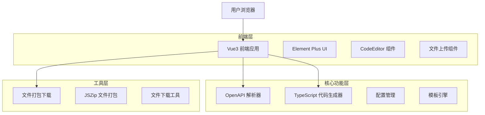
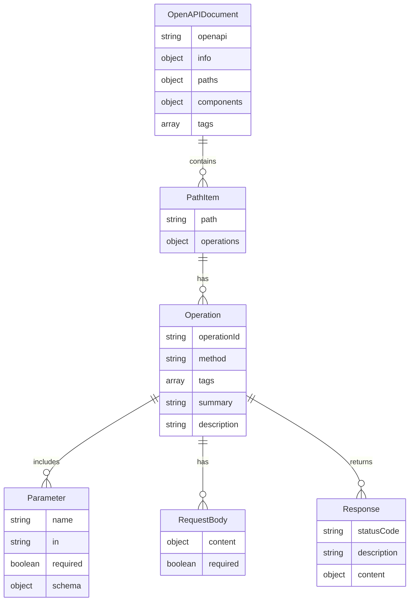

# OpenAPI to TypeScript 转换器 - 技术架构文档

## 1. Architecture design



## 2. Technology Description

* Frontend: Vue3\@3 + TypeScript\@5 + Tailwind CSS\@3 + Vite\@5

* UI Library: Element Plus\@2

* Code Editor: Monaco Editor 或 CodeMirror\@6

* File Processing: JSZip\@3 (文件打包)

* HTTP Client: Axios\@1 (可选，用于 URL 获取)

## 3. Route definitions

| Route     | Purpose          |
| --------- | ---------------- |
| /         | 首页，包含文件上传和配置面板   |
| /generate | 生成结果页面，展示代码和文件结构 |

## 4. API definitions

### 4.1 Core API

由于这是一个纯前端应用，主要的 API 是内部函数调用：

**OpenAPI 解析**

```typescript
interface ParseOpenAPIOptions {
  content: string | object;
  selectedTags?: string[];
  importTemplate?: string;
  namingConvention?: 'camelCase' | 'PascalCase';
}

interface ParseResult {
  success: boolean;
  data?: OpenAPIDocument;
  error?: string;
}

function parseOpenAPI(options: ParseOpenAPIOptions): ParseResult
```

**TypeScript 代码生成**

```typescript
interface GenerateOptions {
  openApiDoc: OpenAPIDocument;
  config: GeneratorConfig;
}

interface GeneratedFile {
  path: string;
  content: string;
  type: 'typescript' | 'json';
}

interface GenerateResult {
  files: GeneratedFile[];
  structure: FileTreeNode[];
}

function generateTypeScriptCode(options: GenerateOptions): GenerateResult
```

**文件下载**

```typescript
interface DownloadOptions {
  files: GeneratedFile[];
  filename?: string;
}

function downloadAsZip(options: DownloadOptions): Promise<void>
function downloadSingleFile(file: GeneratedFile): void
```

## 5. Data model

### 5.1 Data model definition



### 5.2 Data Definition Language

**配置接口定义**

```typescript
// 生成器配置
interface GeneratorConfig {
  // 输出配置
  outputTags: string[];                    // 要生成的 tags
  excludeTags: string[];                   // 要排除的 tags
  
  // 导入语句配置
  importTemplate: string;                  // 导入语句模板
  requestUtilPath: string;                 // 请求工具路径
  
  // 命名规则
  functionNaming: 'camelCase' | 'kebab-case';
  typeNaming: 'PascalCase' | 'camelCase';
  
  // 文件结构
  separateTypes: boolean;                  // 是否分离类型文件
  generateIndex: boolean;                  // 是否生成 index.ts
  generateUtils: boolean;                  // 是否生成工具文件
  
  // 代码风格
  useAsync: boolean;                       // 是否使用 async/await
  includeComments: boolean;                // 是否包含注释
  exportStyle: 'named' | 'default';       // 导出方式
}

// 文件树节点
interface FileTreeNode {
  id: string;
  name: string;
  type: 'file' | 'folder';
  path: string;
  children?: FileTreeNode[];
  content?: string;                        // 文件内容
}

// OpenAPI 文档结构
interface OpenAPIDocument {
  openapi: string;
  info: {
    title: string;
    version: string;
    description?: string;
  };
  paths: Record<string, PathItemObject>;
  components?: {
    schemas?: Record<string, SchemaObject>;
  };
  tags?: TagObject[];
}

// 默认配置
const DEFAULT_CONFIG: GeneratorConfig = {
  outputTags: [],
  excludeTags: [],
  importTemplate: "import { request } from '../utils/request';",
  requestUtilPath: '../utils/request',
  functionNaming: 'camelCase',
  typeNaming: 'PascalCase',
  separateTypes: true,
  generateIndex: true,
  generateUtils: true,
  useAsync: true,
  includeComments: true,
  exportStyle: 'named'
};
```

