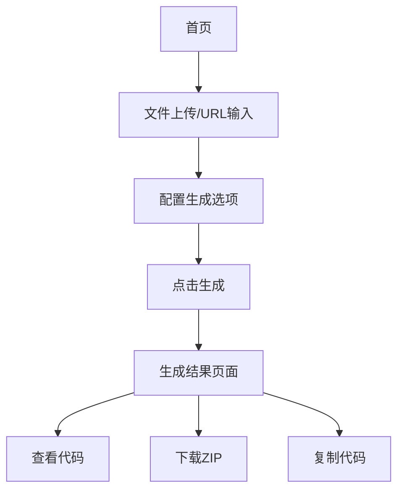

# OpenAPI to TypeScript 转换器 - 产品需求文档

## 1. Product Overview

OpenAPI to TypeScript 转换器是一个基于 Vue3 + TypeScript + Tailwind 的 Web 应用，用于将 OpenAPI 3.0 规范自动转换为 TypeScript 请求模板。
- 解决开发者手动编写 API 接口类型定义和请求函数的重复工作，提高开发效率和代码一致性。
- 面向前端开发者、全栈工程师和 API 集成开发团队。
- 目标是成为开发工具链中不可缺少的代码生成工具，提升团队开发效率。

## 2. Core Features

### 2.1 Feature Module

我们的 OpenAPI 转换器包含以下主要页面：
1. **首页**：文件上传区域、配置面板、生成按钮
2. **生成结果页面**：文件目录树、代码展示区域、下载功能

### 2.2 Page Details

| Page Name | Module Name | Feature description |
|-----------|-------------|---------------------|
| 首页 | 文件上传区域 | 支持拖拽上传 openapi.json 文件，支持 URL 输入获取远程 OpenAPI 文档，文件格式验证和预览 |
| 首页 | 配置面板 | 配置输出 tags 过滤，自定义导入语句模板，配置请求函数名称规则，设置输出文件结构，配置类型命名规则 |
| 首页 | 生成控制 | 验证配置完整性，触发代码生成流程，显示生成进度 |
| 生成结果页面 | 文件目录树 | 展示生成的文件结构，支持文件夹展开收起，文件选择和高亮显示 |
| 生成结果页面 | 代码展示区域 | 使用 CodeEditor 组件展示生成的 TypeScript 代码，支持语法高亮和代码折叠 |
| 生成结果页面 | 下载功能 | 打包所有生成文件为 ZIP 格式，支持单文件下载，提供复制代码功能 |

## 3. Core Process

**主要用户操作流程：**

用户访问首页 → 上传 OpenAPI 文件或输入 URL → 配置生成选项（tags、导入语句、命名规则等）→ 点击生成按钮 → 跳转到生成结果页面 → 查看生成的代码文件 → 下载 ZIP 包或复制代码

## 4. User Interface Design

### 4.1 Design Style

- **主色调**：蓝色系 (#3B82F6) 作为主色，灰色系 (#6B7280) 作为辅助色
- **按钮样式**：圆角按钮，支持悬停和点击状态
- **字体**：系统默认字体，代码区域使用等宽字体 (Monaco, Consolas)
- **布局风格**：卡片式布局，左右分栏设计，响应式网格系统
- **图标风格**：使用 Element Plus 图标库，简洁线性图标

### 4.2 Page Design Overview

| Page Name | Module Name | UI Elements |
|-----------|-------------|-------------|
| 首页 | 文件上传区域 | 大尺寸拖拽区域，虚线边框，上传图标，支持文件和 URL 两种输入方式的 Tab 切换 |
| 首页 | 配置面板 | 右侧固定宽度面板，折叠式配置项，表单控件使用 Element Plus 组件 |
| 生成结果页面 | 文件目录树 | 左侧固定宽度，树形结构，文件夹和文件图标区分，选中状态高亮 |
| 生成结果页面 | 代码展示区域 | 右侧主要区域，深色主题代码编辑器，语法高亮，行号显示 |
| 生成结果页面 | 下载功能 | 右上角固定位置，下载按钮和复制按钮，操作成功提示 |

### 4.3 Responsiveness

产品采用桌面优先设计，针对移动端进行适配优化。在移动设备上，配置面板改为底部抽屉式设计，代码展示区域支持触摸滚动和缩放操作。